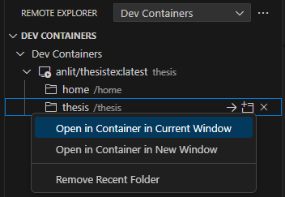
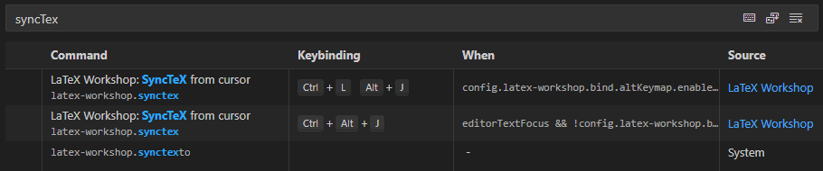

# 國立中正大學碩博士論文LaTeX模板
本模板適用於國立中正大學碩博士論文的撰寫，並設置好論文基本架構和基礎語法示例供使用者參考，使用者只需根據自己的需求進行增減即可，已預先設置 Times New Roman 與標楷體兩種通用字型。

> English version of `README` file please refer to [README_English.md](https://github.com/anlit75/CCU-Thesis-LaTeX-Template/blob/master/README_English.md)

## 目錄 | Table of Contents
- [入門 | Getting Started](#入門--getting-started)
- [模板範例演示 | Template Demonstration](#模板範例演示--template-demonstration)
- [模板檔案結構 | Template Structure](#模板檔案結構--template-structure)
- [LaTeX環境建置 | LaTeX Environment Setup](#latex環境建置--latex-environment-setup)
    - [Docker Environment Setup](#docker-environment-setup)
    - [Local Environment Setup](#local-environment-setup)
- [模板使用說明 | User Guide](#模板使用說明--user-guide)
- [致謝 | Acknowledgement](#致謝--acknowledgement)
- [合作者 | Collaborators](#合作者--collaborators)
- [免責聲明 | Disclaimer](#免責聲明--disclaimer)
- [License](#license)

## 入門 | Getting Started
您有以下幾種方式可以取得本模板，請依照自己的喜好選擇 :
1. 下載本模板的 zip 檔案
2. 使用 git clone 指令 : `git clone https://github.com/anlit75/CCU-Thesis-LaTeX-Template.git`
3. 使用 fork 功能將本模板複製到自己的 GitHub
4. 下載 release 版本 : https://github.com/anlit75/CCU-Thesis-LaTeX-Template/releases
5. 點擊**此頁面右上方綠色**的 `Use this template` 按鈕，創建一個新的 repository ( 推薦使用此方式 )

如果您之前未使用過 Git / GitHub，以下是一些入門指南：
- Basics of git : [Learn the Basics of Git in Under 10 Minutes](https://www.freecodecamp.org/news/learn-the-basics-of-git-in-under-10-minutes-da548267cc91/)
- GitHub Fork : [Fork a repository](https://docs.github.com/en/get-started/quickstart/fork-a-repo)

## 模板範例演示 | Template Demonstration
以下為模板的範例檔案，僅供參考 : 
- [demo/master_chinese_template.pdf](./demo/master_chinese_template.pdf) 為**碩士繁體中文**論文範例檔案
- [demo/doctor_chinese_template.pdf](./demo/doctor_chinese_template.pdf) 為**博士繁體中文**論文範例檔案

## 模板檔案結構 | Template Structure
```
Template Structure
├── main.tex                            // 主文件
├── main.pdf                            // 主文件編譯後的PDF檔
├── frontpages
│   ├── abstract.tex                    // 中/英文摘要
│   ├── acknowledgement.tex             // 致謝
│   ├── denotation.tex                  // 符號列表
│   └── verification.pdf                // 論文審定書PDF檔
├── sections
│   ├── introduction.tex                // 緒論
│   ├── related_work.tex                // 文獻探討
│   ├── method.tex                      // 研究方法
│   ├── experiments.tex                 // 研究結果
│   └── conclusion.tex                  // 結論
├── backpages
│   ├── appendix.tex                    // 附錄
│   └── reference.bib                   // 參考文獻資料庫
├── figures
│   ├── watermark.jpg                   // 浮水印
│   └── ...
├── fonts
│   ├── chinese
│   │   ├── BiauKai.ttf                 // 標楷體
│   │   └── ...
│   └── english
│       ├── Times New Roman-*.ttf       // Times New Roman
│       └── ...
├── demo
│   ├── master_chinese_template.pdf     // 碩士繁體中文論文範例檔案
│   ├── doctor_chinese_template.pdf     // 博士繁體中文論文範例檔案
│   └── ...
├── ccusetup.tex                        // 模板設定
└── ccuthesis.cls                       // 模板文件
```

請依據內容撰寫在相對應的 .tex 檔案。如需增減章節，可在 sections 資料夾中增加/移除 `.tex` 檔進行調整，並在主文件 `main.tex` 中根據增減的位置用 `\input{./path/to/texfile}` 語法新增章節，或刪除相關章節即可。

## LaTeX環境建置 | LaTeX Environment Setup
> 在建置 LaTeX 環境之前，請先確保已下載本模板至本機端!

以下兩種環境建置方式供使用者選擇，只須**擇一安裝**即可，建議使用 [Docker Environment Setup](#docker-environment-setup) 來避免環境設定的問題。若對於 Docker 不熟悉，可參考 [Local Environment Setup](#local-environment-setup) 自行安裝環境。

### Docker Environment Setup
- Requirements : `Docker`, `VSCode`
1. 安裝 `Docker Desktop` ( https://www.docker.com/products/docker-desktop )，安裝後須重新啟動電腦
2. 安裝 `VSCode`，並安裝 `Remote Explorer`、`Dev Containers`、`Docker (optional)` 擴充程式

#### 建立 Docker Container
於論文根目錄下開啟 `VSCode`，並在終端機中輸入以下指令，即可建立 Docker Container :

```bash
# --name thesis : 指定 container 名稱為 thesis (可自行更改)
docker run -itd --name thesis -v .:/home/thesis anlit/thesistex:latest
```

接著在 `Remote Explorer` 擴充程式中會看到剛建立的 container，如下圖所示，接著在 `thesis` 資料夾處右鍵，選擇 `Open in Container in Current Window` 即可進入 container 環境中。

<div style="text-align: center;">
     <br>
    Remote Explorer - Dev Container <br><br>
     <br>
    Open in Container in Current Window <br><br>
</div>

接下來就可以根據[模板使用說明](#模板使用說明--user-guide)來使用模板了。

### Local Environment Setup
- Requirements : `MiKTex`, `perl`, `VSCode (optional)`
1. 安裝 `MiKTex`，並設置為預設的compiler ( https://miktex.org/download )
2. 安裝 `perl` ( https://strawberryperl.com/ )
3. 安裝 `VSCode`，並安裝 `LaTeX Workshop`、`LaTeX Utilities` 擴充程式

> 安裝完成後須重新啟動 VSCode!

#### LaTeX Workshop Settings
在 `settings.json` 中，recipes 可以調換順序，最上面的是預設執行的compiler，須將 `"latexmk (xelatex)"` 組別移動到最上方，如下所示 :

```json
"latex-workshop.latex.recipes": [
    {
        "name": "latexmk (xelatex)",
        "tools": [
            "xelatexmk"
        ]
    },
    {
        "name": "latexmk",
        "tools": [
            "latexmk"
        ]
    },
    {
        "name": "latexmk (latexmkrc)",
        "tools": [
            "latexmk_rconly"
        ]
    },
    {
        "name": "latexmk (lualatex)",
        "tools": [
            "lualatexmk"
        ]
    },
    ...
],

// 可選參數
"latex-workshop.latex.autoBuild.run": "onSave",         // 當儲存時自動編譯
"latex-workshop.latex.autoClean.run": "onSucceeded",    // 當編譯成功時自動清理
```

#### LaTeX Workshop SyncTex
在 Shorcut Settings 中可以設置 `SyncTex` 的快捷鍵 (如下圖所示)，預設為 `ctrl+alt+j`，可自行調整。



- `ctrl+Left-Click` PDF檔案中的文字，會自動跳轉到對應的 `.tex` 檔案中
- 在`.tex`檔案中使用 `ctrl+alt+j` 會自動跳轉到對應的PDF檔案中

實際操作效果如下所示 :


#### LaTeX Utilities Settings
此擴充程式可以在**貼上**時自動生成模板，適用於表格及圖片，請先在 `settings.json` 中輸入下方設定 :

```json
//true時使用`ctrl+v`自動套用模板，若為false則需使用`ctrl+shift+v`
"latex-utilities.formattedPaste.useAsDefault": false,

// 圖片模板 figure template
"latex-utilities.formattedPaste.image.template": [
    "\\begin{figure}[!htb]",
    "\t\\centering",
    "\t\\includegraphics[width=\\textwidth]{${imageFilePath}}",
    "\t\\caption{${imageFileNameWithoutExt}}",
    "\t\\label{fig:${imageFileNameWithoutExt}}",
    "\\end{figure}",
    ""
],
```

實際操作效果如下所示 :


更詳細的設定請參考 [LaTeX Utilities Wiki](https://github.com/tecosaur/LaTeX-Utilities/wiki)

## 模板使用說明 | User Guide
詳細模板使用說明請見 [Wiki Page](https://github.com/anlit75/CCU-Thesis-LaTeX-Template/wiki)，請依造下列順序進行閱讀，並根據指示修改設定 :
1. [模板資料設定](https://github.com/anlit75/CCU-Thesis-LaTeX-Template/wiki/Thesis-Configurations)
2. [模板使用說明](https://github.com/anlit75/CCU-Thesis-LaTeX-Template/wiki/User-Guide)
3. [LaTeX基本語法](https://github.com/anlit75/CCU-Thesis-LaTeX-Template/wiki/LaTeX-Basic-Syntax)

## 致謝 | Acknowledgement
感謝以下模板作者的貢獻，提供了許多參考，使得本模板能夠順利完成 : 
- [Hsins/NTU-Thesis-LaTeX-Template](https://github.com/Hsins/NTU-Thesis-LaTeX-Template)
- [hasanabs/nsysu-thesis-latex-template](https://github.com/hasanabs/nsysu-thesis-latex-template)
- [joeyuping/ccu-thesis-latextemplate](https://github.com/joeyuping/ccu-thesis-latextemplate)

## 合作者 | Collaborators
特別感謝 [joeyuping](https://github.com/joeyuping) 學長的貢獻，使得本模板能夠更加完善 !

## 免責聲明 | Disclaimer
本模板為非官方版本，因此格式可能有誤，僅供參考，若使用上有任何問題，請自行承擔風險。

建議使用者根據系上的要求進行調整，若有任何問題，請提 issues 或是寄信至[作者信箱](mailto:anson40512@gmail.com)。

## License
MIT License

CopyRight (c) 2024 Ting-An Cheng

Permission is hereby granted, free of charge, to any person obtaining a copy  
of this software and associated documentation files (the "Software"), to deal  
in the Software without restriction, including without limitation the rights  
to use, copy, modify, merge, publish, distribute, sublicense, and/or sell  
copies of the Software, and to permit persons to whom the Software is  
furnished to do so, subject to the following conditions:

The above copyright notice and this permission notice shall be included in all  
copies or substantial portions of the Software.

THE SOFTWARE IS PROVIDED "AS IS", WITHOUT WARRANTY OF ANY KIND, EXPRESS OR  
IMPLIED, INCLUDING BUT NOT LIMITED TO THE WARRANTIES OF MERCHANTABILITY,  
FITNESS FOR A PARTICULAR PURPOSE AND NONINFRINGEMENT. IN NO EVENT SHALL THE  
AUTHORS OR COPYRIGHT HOLDERS BE LIABLE FOR ANY CLAIM, DAMAGES OR OTHER  
LIABILITY, WHETHER IN AN ACTION OF CONTRACT, TORT OR OTHERWISE, ARISING FROM,  
OUT OF OR IN CONNECTION WITH THE SOFTWARE OR THE USE OR OTHER DEALINGS IN THE  
SOFTWARE.
