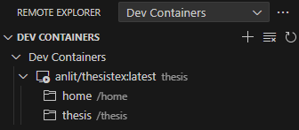
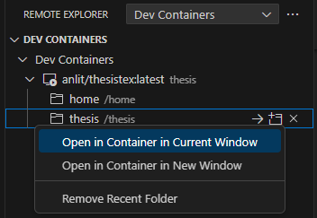
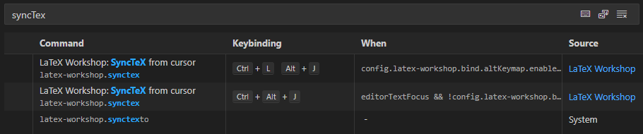

# National Chung Cheng University (CCU) Thesis LaTeX Template

A Dockerized LaTeX template for National Chung Cheng University theses automates environment setup and formatting compliance.\
Ensures reproducible results across any operating system, allowing you to focus solely on research.

## Table of Contents
- [⚡ Get The Template](#-get-the-template)
- [🚀 Quick Start](#-quick-start)
- [⚙️ Local Installation](#️-local-installation)
    - [🐳 Local DevContainer (Standard / Local Development)](#-local-devcontainer-standard--local-development)
    - [🛠️ Local LaTeX Environment (Advanced / Manual Configuration)](#️-local-latex-environment-advanced--manual-configuration)
- [📂 Template Structure](#-template-structure)
- [📖 User Guide](#-user-guide)
    - [🎨 Template Demonstration](#-template-demonstration)
- [🤝 Acknowledgement](#-acknowledgement)
- [⚠️ Disclaimer](#️-disclaimer)
- [📄 License](#-license)

## ⚡ Get The Template

Click the green **`[Use this template]`** button above and select **Private** to create your thesis repository.

> [!WARNING]\
> It is recommended not to directly Fork this repository!\
> Theses should remain confidential, and Forked repositories are public by default (unless you intend to contribute code).

## 🚀 Quick Start

**Suitable for:** Users who do not want to install any software, have limited computer performance, or simply want a quick preview.

This will launch a full GitHub Codespaces environment in your browser with **no setup required**.

1. Click the green **`Code`** button at the top right of the page > switch to the **`Codespaces`** tab.
2. Click **`Create codespace on branch-name`**.
3. Wait for the browser to load the environment (approx. 10-15 minutes for the first time).
4. **Done!**

> [!TIP]\
> Open the `main.tex` file and press `Ctrl+S` to trigger compilation automatically.\
> Or click the "TeX" icon on the left > `Build LaTeX project`.\
> \
> Once compiled, the PDF file will automatically appear in the file explorer on the right.\
> Press `ctrl+alt+j` within a `*.tex` file to jump to the corresponding location in the PDF.

> [!NOTE]\
> You can now skip `⚙️ Local Installation`. Proceed to the [User Guide](#-user-guide) to start writing your thesis.

> [!WARNING]\
> Free accounts have a monthly GitHub Codespaces usage quota of approximately 120 hours.\
> Please refer to the [Official GitHub Documentation](https://docs.github.com/en/billing/concepts/product-billing/github-codespaces) for actual usage limits and more information.

## ⚙️ Local Installation

If you require **long-term offline writing** or prefer using local VS Code, please choose one of the following methods.

### 🐳 Local DevContainer (Standard / Local Development)

**Suitable for:** Users who want to work offline on their own computer and are accustomed to local VS Code.

#### Docker Environment Setup

1. Install [Docker Desktop](https://www.docker.com/products/docker-desktop); restart your computer after installation.
2. Install VS Code along with the `Remote Explorer`, `Dev Containers`, and `Docker (optional)` extensions.

#### Launch Steps

1. `git clone` your thesis repository.
2. Open the repository folder with VS Code.
3. Click the **"Reopen in Container"** prompt in the bottom right corner (or press `F1` and search for `Dev Containers: Reopen in Container`).
4. Wait for the container to start; the environment will be configured automatically (approx. 10-15 minutes for the first time).
5. **Done!**

<details>
<summary><strong>If the above steps do not work, manually create the Docker Container (Click to expand)</strong></summary>

Open VS Code in the root directory of the thesis template, and enter the following command in the terminal to create a Docker Container :

```bash
# --name thesis : Specify the container name as thesis (can be changed by yourself)
docker run -itd --name thesis -v .:/home/thesis anlit/thesistex:latest
```

Next, in the `Remote Explorer` extension, you will see the newly created container as shown in the following image.  
Right-click on the `thesis` folder and select `Open in Container in Current Window` to enter the container environment.

<div style="text-align: center;">
     <br>
    Remote Explorer - Dev Container <br><br>
     <br>
    Open in Container in Current Window <br><br>
</div>

</details>

> [!NOTE]\
> Proceed to the [User Guide](#-user-guide) to start writing your thesis.

### 🛠️ Local LaTeX Environment (Advanced / Manual Configuration)

**Suitable for:** Advanced users familiar with the LaTeX ecosystem who cannot use Docker or require high customization.

> [!CAUTION]\
> This method is highly susceptible to compilation failures due to differences in operating systems, versions, or path settings.

<details>
<summary><strong>Manual Installation Tutorial (Click to expand)</strong></summary>

#### Local Environment Setup

1. Install `MiKTex` and set it as the default compiler ( [https://miktex.org/download](https://miktex.org/download) ).
2. Install `perl` ( [https://strawberryperl.com/](https://strawberryperl.com/) ).
3. Install VS Code and the `LaTeX Workshop` and `LaTeX Utilities` extensions.

> After the installation is complete, VSCode must be restarted!

#### LaTeX Workshop Settings
In the `settings.json` file, you can rearrange the order of the recipes, and the one at the top will be the default compiler.  
Move the group `latexmk (xelatex)` to the top, as shown below:

```json
"latex-workshop.latex.recipes": [
    {
        "name": "latexmk (xelatex)",
        "tools": [
            "xelatexmk"
        ]
    },
    {
        "name": "latexmk",
        "tools": [
            "latexmk"
        ]
    },
    {
        "name": "latexmk (latexmkrc)",
        "tools": [
            "latexmk_rconly"
        ]
    },
    {
        "name": "latexmk (lualatex)",
        "tools": [
            "lualatexmk"
        ]
    },
    ...
],

// Optional parameters
"latex-workshop.latex.autoBuild.run": "onSave",         // automatically compile when saving
"latex-workshop.latex.autoClean.run": "onSucceeded",    // automatically clean up when compilation is successful
```

#### LaTeX Workshop SyncTex
In the Keyboard Shortcuts Settings, you can configure the shortcut for `SyncTex` as shown in the image below.  
The default is `ctrl+alt+j`, but you can adjust as needed.



- Press `ctrl+Left-Click` on the text in the PDF file to automatically jump to the corresponding location in the .tex file.
- In the `.tex` file, use `ctrl+alt+j` to automatically jump to the corresponding location in the PDF file.

The actual operation results are demonstrated as follows :


#### LaTeX Utilities Settings
This extension can automatically generate formatted tables and figures when **pasting** into vscode.  
Please paste the following settings in the `settings.json` file :

```json
// The template is automatically applied when `ctrl+v` is used. If it is false, you need to use `ctrl+shift+v`
"latex-utilities.formattedPaste.useAsDefault": false,

// figure template
"latex-utilities.formattedPaste.image.template": [
    "\\begin{figure}[!htb]",
    "\t\\centering",
    "\t\\includegraphics[width=\\textwidth]{${imageFilePath}}",
    "\t\\caption{${imageFileNameWithoutExt}}",
    "\t\\label{fig:${imageFileNameWithoutExt}}",
    "\\end{figure}",
    ""
],
```

The actual operation results are demonstrated as follows :


For further settings please refer to [LaTeX Utilities Wiki](https://github.com/tecosaur/LaTeX-Utilities/wiki).

</details>

## 📂 Template Structure

```
Template Structure
├── main.tex                            // Main document
├── main.pdf                            // Compiled PDF of the main document
├── frontpages
│   ├── abstract.tex                    // Chinese/English Abstract
│   ├── acknowledgement.tex             // Acknowledgement
│   ├── denotation.tex                  // List of Symbols
│   └── verification.pdf                // Thesis Validation Form (PDF)
├── sections
│   ├── introduction.tex                // Introduction
│   ├── related_work.tex                // Related Work
│   ├── method.tex                      // Methodology
│   ├── experiments.tex                 // Results/Experiments
│   └── conclusion.tex                  // Conclusion
├── backpages
│   ├── appendix.tex                    // Appendix
│   └── reference.bib                   // Bibliography database
├── figures
│   ├── watermark.jpg                   // Watermark
│   └── ...
├── demo
│   ├── master_chinese_template.pdf     // Master's Thesis Example (Traditional Chinese)
│   ├── doctor_chinese_template.pdf     // Doctoral Thesis Example (Traditional Chinese)
│   └── ...
├── ccusetup.tex                        // Template configurations
└── ccuthesis.cls                       // Template class file

```

> [!NOTE]\
> Please write content in the corresponding `.tex` files.\
> To add or remove chapters, create/remove `.tex` files in the `sections` folder and use the `\input{./path/to/texfile}` syntax in `main.tex` to include or exclude them.

## 📖 User Guide

For detailed instructions on using the template, please refer to the [Wiki Page](https://github.com/anlit75/CCU-Thesis-LaTeX-Template/wiki).  
Please read in the following order and make configuration adjustments accordingly :

1. [Editing Thesis Configurations](https://github.com/anlit75/CCU-Thesis-LaTeX-Template/wiki/Thesis-Configurations-English)
2. [User Guide](https://github.com/anlit75/CCU-Thesis-LaTeX-Template/wiki/User-Guide-English)
3. [LaTeX Basic Syntax](https://github.com/anlit75/CCU-Thesis-LaTeX-Template/wiki/LaTeX-Basic-Syntax-English)

### 🎨 Template Demonstration
Below are prefilled thesis using the template for your reference : 
- [demo/master_chinese_template.pdf](./demo/master_chinese_template.pdf) is a demo file of **Master Traditional Chinese** thesis
- [demo/doctor_chinese_template.pdf](./demo/doctor_chinese_template.pdf) is a demo file of **Ph.D. Traditional Chinese** dissertations

## 🤝 Acknowledgement

Huge thanks to the following template authors for their contributions.  
Their work has provided valuable references and has contributed to the successful completion of this template :
- [Hsins/NTU-Thesis-LaTeX-Template](https://github.com/Hsins/NTU-Thesis-LaTeX-Template)
- [hasanabs/nsysu-thesis-latex-template](https://github.com/hasanabs/nsysu-thesis-latex-template)
- [joeyuping/ccu-thesis-latextemplate](https://github.com/joeyuping/ccu-thesis-latextemplate)

> [!IMPORTANT]\
> Special thanks to [joeyuping](https://github.com/joeyuping) for his contributions, which have greatly enhanced the completeness of this template!

## ⚠️ Disclaimer

This template is an unofficial version, and the format may contain errors. It is provided for reference only, and users should use it at their own risk.

It is recommended that users make adjustments according to the requirements of their department. 
If there are any problem, please feel free to create the issues or send an email to the [author's email](mailto:anson40512@gmail.com).

## 📄 License

[MIT License](LICENSE)

Copyright (c) 2024 Ting-An Cheng
